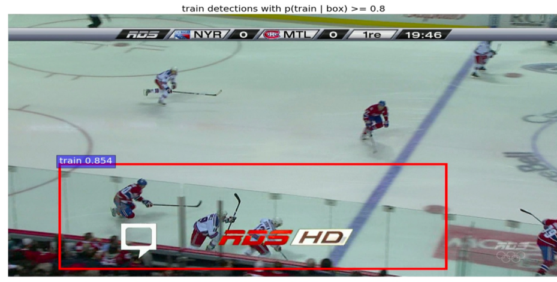
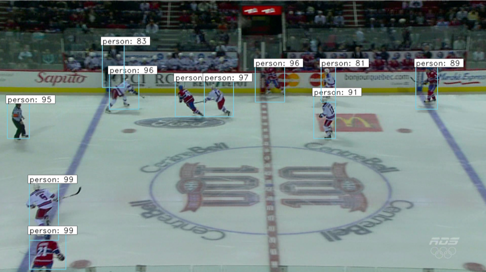
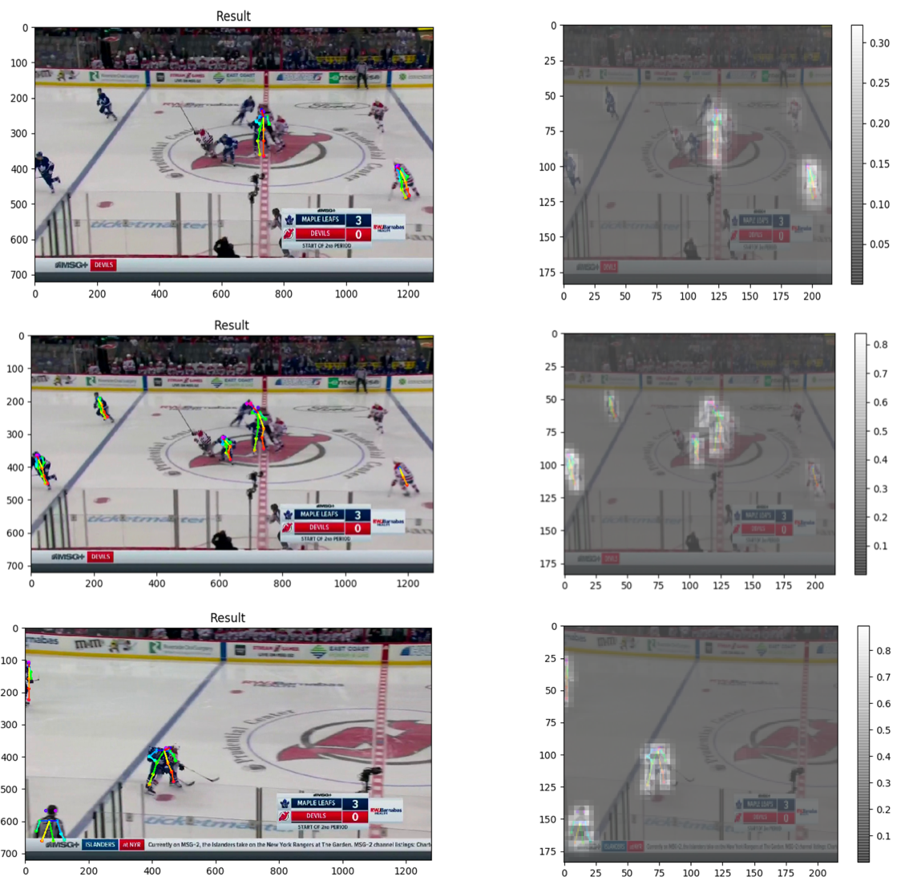
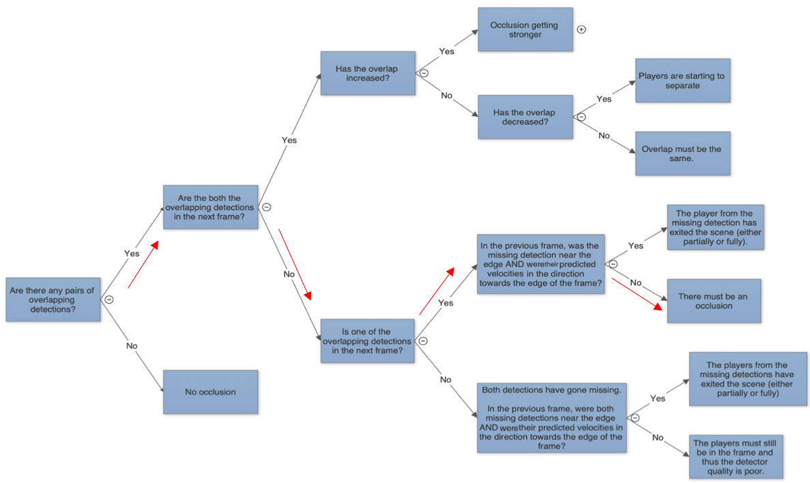
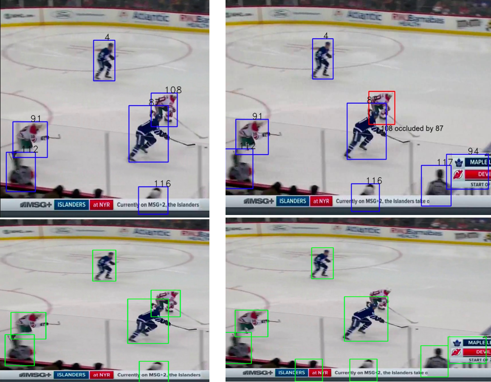

# Multi-Object-Detection and Tracking in Hockey

The following is the results of ~5 months of an independent research project, working on multi-object detection and tracking in Hockey in the Vision and Image Processing Lab.

Over the course of these 5 months, I implemented detection and tracking in Hockey via Faster RCNN (FrRCNN) and SORT, respectively, as well as some new ideas I had to improve their performance. After establishing the benchmark performance with these state-of-the-art algorithms, I proposed possible solutions to their bottlenecks and implemented these ideas in python, specifically targetting detecting and tracking through occlusions. 

**_The contents of this project are too large to upload to github. I have attached a dropbox link_** to a zip file
that contains a video of my implementation of the tracking algorithm, as well as a report that contains an in-depth explanation of all my work, including: transfer learning for improved detections via FrRCNN (+results), SORT for tracking (+results), my proposals, their implmentations, and their results.

**Dropbox link**: https://www.dropbox.com/s/2zbmkaztfla8avp/Results.zip?dl=0

Due to the nature of the work, I will not be able to share the dataset/annotations; sincerest apologies.

# Summary

Faster RCNN was used for the detection of hockey players (classification + bounding box regression). The neural network had been previously trained on pedestrian data and thus transfer learning was used to update the weights to account for the fact that I was trying to detect hockey players. All output classes except 'background' and 'player' were turned off. 

For tracking, Simple Online and Realtime Tracker was used, which implemented the kalman filter to improve the detection co-ordinates and the hungarian algorithm for association of detections in a pair of consecutive frames. The quality of the tracking is limited by the quality of the detector.

Given that hockey is a game that is played in closed quarters and is a high contact sport, occlusions are frequent. This presents a challenge for high quality tracking. To help with occlusions, the first step was to detect and determine where and when an occlusion might be occuring. Two different methods were explored, with the latter offering the greatest promise:

1) Using joint infromation from a pose-estimation network to dicern when more than one player is present in a bounding box  
2) Using a decision tree to determine whether an occlusion has led to a missing detection by analyzing the manner in which bounding boxes overlap

# Sample Results

#### Detections

Pre- transfer learning sample output:

Post- transfer learning sample output:

#### SORT Algorithm

Below is a small snipet of the video from the zip file in the dropbox link. For analysis, please see full report. 

#### Pose Estimation

Sample images from the pose estimation network

#### Decision Tree

Decision Tree implementation. Path shown by the red arrows indicates the primary path of interest. The "X" over a box denotes skipped  denotes skipped decisions. 

Sample results of my decision tree algorithm

Two consecutive frames, moving forward in time from left to right. 
Top: is the result after traversing the decision tree and the 
Bottom: without traversing the decision tree. 
Notice that the outcome of the decision tree provides two pieces of information: "<Player1_ID> occluded by <Player2_ID>" as well as a predicted red box of where the missed detection might be.

# Public Repositories Used

Detections (Faster RCNN): https://github.com/kbardool/keras-frcnn  
Tracking (SORT): https://github.com/abewley/sort  
Pose Estimation (open-pose): https://github.com/ildoonet/tf-pose-estimation

